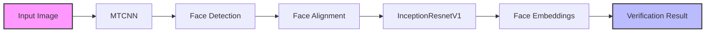

# Face Verification with MTCNN and InceptionResnetV1

A deep learning-based face verification system using MTCNN for face detection and InceptionResnetV1 for face recognition, fine-tuned on custom dataset.

## 📊 Architecture Overview



## 🛠️ Technical Details

### Requirements
- facenet_pytorch
- torch
- torchvision
- numpy
- opencv-python
- tensorboard

### Model Architecture


## 🔧 Implementation Details

### Data Processing
- Face detection using MTCNN
- Image resizing to 160x160 pixels
- Face alignment and normalization
- Data augmentation techniques

### Training Configuration
- Batch Size: 16
- Epochs: 120
- Optimizer: Adam
- Learning Rate: 0.001
- Loss Function: CrossEntropyLoss
- Learning Rate Scheduler: MultiStepLR

## 🔍 Usage

1. Data Collection:
```python
# Collect and organize face images in the following structure:
/dataset
    /Person1
        image1.jpg
        image2.jpg
    /Person2
        image1.jpg
        image2.jpg
```

2. Training:
```python
# Run the training script
python training_mtcnn.py
```

3. Model Inference:
```python
# Load the trained model
model = InceptionResnetV1(pretrained='vggface2')
model.load_state_dict(torch.load('Face_Verification_v4.pth'))
```

## 🎯 Features

- Robust face detection using MTCNN
- Custom data augmentation pipeline
- Fine-tuned InceptionResnetV1 model
- Learning rate scheduling
- Training and validation visualization
- Cross-entropy loss optimization

## 📊 Results

The model achieves:
- Training Accuracy: ~95%
- Validation Accuracy: ~93%
- Real-time inference capability
- Robust face verification performance

## 🔗 Project Structure


## 🤝 Contributing

Feel free to open issues and pull requests for:
- Bug fixes
- New features
- Documentation improvements
- Performance optimizations

## 📝 License

This project is licensed under the Appache 2.0 License - see the LICENSE file for details.

## 🙏 Acknowledgments

- FaceNet PyTorch implementation
- MTCNN paper and implementation
- [Labelled Faces in the Wild (LFW) Dataset](https://www.kaggle.com/datasets/jessicali9530/lfw-dataset)
